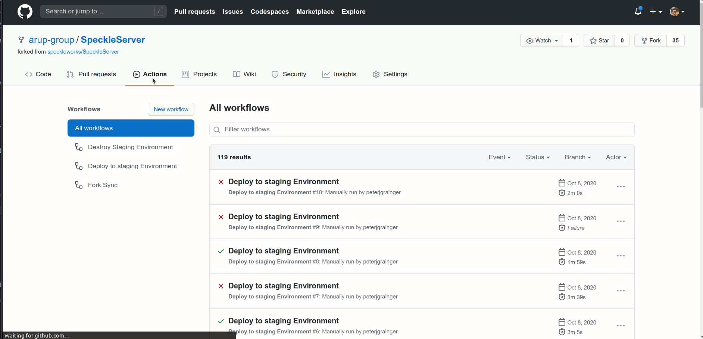

# Speckle Server

This is the Speckle Server (Community Extension), which coordinates communications between the various bits of the Speckle ecosystem. 

The Community Extension Speckle were born when the Speckle Systems crew discontinued Speckle v1, and started development a v2. At the moment,
[Arup Group](https://www.arup.com/) is maintaining the Community Extension produts, and developing them further to meet the needs of our project
teams and clients. Our work remains open source, and we hope that will be valuable to anyone else working with Speckle v1.

## API

[API docs are here](https://speckleworks.github.io/SpeckleSpecs/) - they are a good overview of what you can do.

## Installation

The Speckle Server is a nodejs (`v.8+`, `latest stable` preffered) app.

- Dependencies: [mongodb](https://www.mongodb.com/download-center/community) and [redis](https://redis.io/). 
- Clone this repo `git clone https://github.com/arup-group/SpeckleServer.git`
- Configuration: create a `.env` using `.env-base` as a template, and fill in the required information.
- Run `npm install` and thereafter `npm run`.

#### ⚠️ **Warning**: if these instructions seem confusing and you want to use speckle in production, please consult someone with more experience! Incorrect configuration can have **security and reliability implications**. 

> Community supported instructions by on how to set up a development server (thanks @arendvw!) can be found in [this discourse thread](https://discourse.speckle.works/t/speckle-server-debian-9-installation-notes-for-development-machines/344). Feel free to contribute your own experiences there, or ask questions.

To install a front-end plugin, such as the [admin ui](https://github.com/arup-group/SpeckleAdmin), clone the respective repo in the `plugins` folder of the server.

### Deploy at Arup

#### Staging Environment

If you have write access to this repository then you can trigger a deploy to the Staging Environment.

Steps for deploy are:

1. Select Actions Tab
2. Select `Deploy to staging Environment` workflow
3. Press the `Run Workflow` button
4. Select the `Master` branch
5. Input the tag to deploy in the `tag to deploy (without the v)` input box e.g. `1.9.10`
6. Input the branch of the ansible scripts you want to run in the `branch of the global-speckle-server-ansible-playbooks repos` input box e.g. `master`
7. Press the `Run Workflow` button
8. Verify workflow was a success 🎉️
9. See the artefacts attached to the workflow for logs of any errors

#### Production Environment

1. Select Actions Tab
2. Select `Deploy to Production Environment` workflow
3. Press the `Run Workflow` button
4. Select the `Master` branch
5. Input the tag to deploy in the `tag to deploy (without the v)` input box e.g. `1.9.10`
6. Input the region you want to deploy to in `The region to deploy to ireland, hongkong, australia, uk or canada` input box e.g. `ireland`
6. Input the branch of the ansible scripts you want to run in the `branch of the global-speckle-server-ansible-playbooks repos` input box e.g. `master`
7. Press the `Run Workflow` button
8. Verify workflow was a success 🎉️
9. See the artefacts attached to the workflow for logs of any errors

## Get In Touch

If you have any questions, you can get in touch with the rest of the world-wide specklers via: 
- [Discourse](https://discourse.speckle.works)
- [Slack](https://slacker.speckle.works)

If you have any questions about the Community Extensions, please contact [David de Koning](https://github.com/daviddekoning/)

## License
[MIT](https://github.com/speckleworks/SpeckleServer/blob/master/LICENSE)

## v2

Speckle Systems is working on a v2 of the Speckle ecosystem. Read more about the announcemnt [here](https://speckle.systems/blog/speckle2-vision-and-faq) and check out their new [website](https://speckle.systems).
